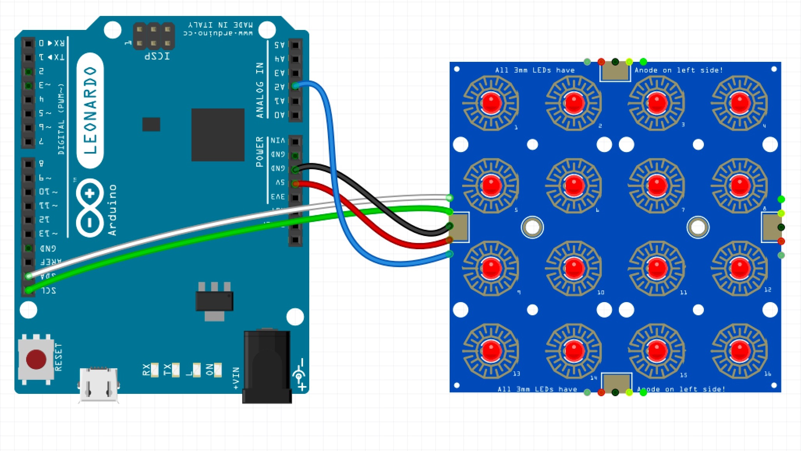
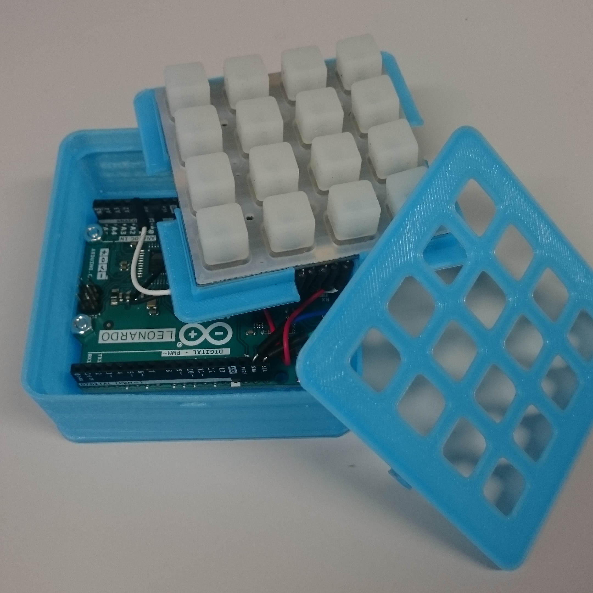
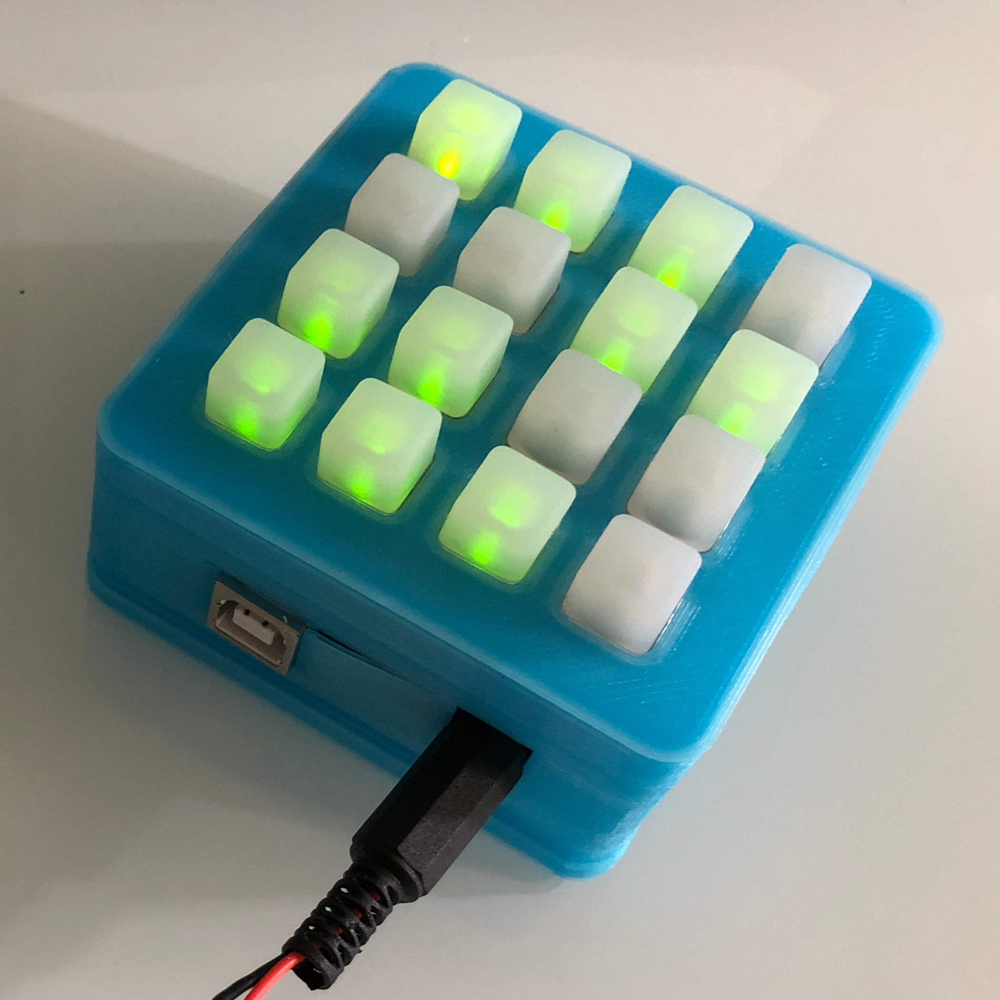
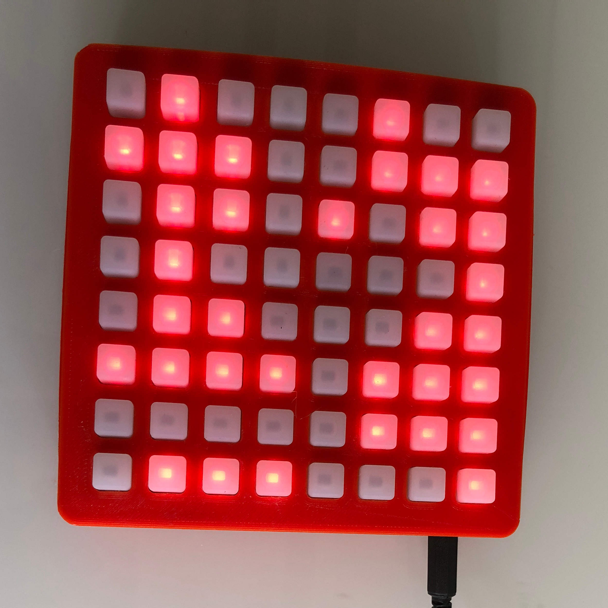

# Lights Out

[Lights Out](https://en.wikipedia.org/wiki/Lights_Out_(game)) is an electronic game released by Tiger Electronics in 1995.
The game consists of a 5 x 5 grid of lights. The game starts, a random number of lights are switched on. Pressing any of the lights will toggle it and its 4 adjacent lights. The goal of the game is to find the smallest combination of lights in order to switch all the lights off.

## Material
  - 3D Printer and 3D filament
  - [Adafruit Trellis](https://www.adafruit.com/product/1616)
  - [Adafruit Silicon Keypad](https://www.adafruit.com/product/1611)
  - Leds
  - Wires
  - Arduino
  - Soldering iron and solder
  - ø3x12 countersunk head bolts and nuts

## DIY
  1. Print the [box](3DModels/)
  
  
  
  2. Solder the leds on the Trellis
  
  2. For the big board, solder the trellis together and their identification
  
  3. Solder the wires on the Trellis
  4. Fix the Arduino on the bottom of the box
  5. Wire the Trellis to the Arduino
  
  
  
  6. Assemble the box
  
  
  
  7. Using the [Arduino IDE](https://www.arduino.cc/en/Main/Software) download the [code](code/) on the Arduino
  
  
  
  
## Activity description
  1. Tell the participant the rules of the game
  2. Let them play around and try to switch off the lights
  3. If they are stuck and need some help show them the [light chasing](https://en.wikipedia.org/wiki/Lights_Out_(game)#Light_chasing) strategy
  4. Once solved, press on a fixed number k of lights, tell the participants they can solve it by pressing on k lights
  5. If they still want to play tell them now that they have to turn on all the lights

## Sources
  - 3D Models based on the [Trellis Box](https://www.thingiverse.com/thing:211447)
  - Code based on the [Adafruit Trellis Library](https://github.com/adafruit/Adafruit_Trellis_Library)
  - Activity inspired by the article [Lights Out: A little mathematic game](https://github.com/Mystelven/LightsOuts-Math)
