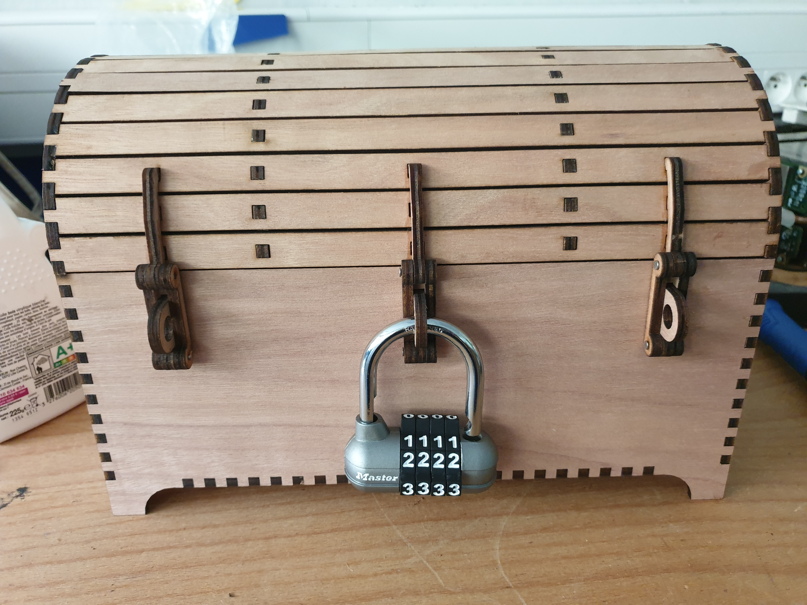

# Computer Science escape game

This escape game is composed of three enigmas:
  - Graph coloring
  - N-queens
  - Lights On

Each enigma gives you a combinaison to open a lock.

All three locks close a treasure chest in which you can put either the key of the room, or a gift for the participants.
.